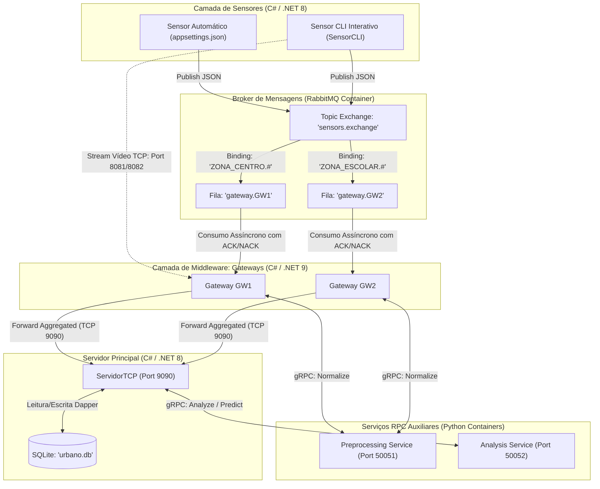

# Relatório de Estado Atual e Arquitetura — TP2 Sistemas Distribuídos

Este documento apresenta a análise do estado de desenvolvimento do **Trabalho Prático 2 (TP2)** para a Unidade Curricular de **Sistemas Distribuídos (2025/2026)**, cobrindo a arquitetura atual do sistema, o detalhe dos comandos implementados e o guia de testes manuais.

---

## 1. Arquitetura do Sistema

O sistema evoluiu de uma comunicação direta cliente-servidor síncrona por sockets TCP para uma **arquitetura distribuída, híbrida e assíncrona** assente em filas de mensagens (Message Broker) e chamadas a procedimentos remotos (RPC).

### Diagrama de Arquitetura



### Componentes e Tecnologias

1.  **Sensores ([SensorClient](file:///c:/Users/Utilizador/source/repos/TP1-SISTEMAS-DISTRIBUIDOS/Sensor/Sensor.cs)):** 
    *   Simulam localmente o fluxo do protocolo anterior (`CONNECT`, `REGISTER_TYPES`) para manter a compatibilidade da CLI, mas publicam as leituras reais no broker.
    *   **Publicação assíncrona** no RabbitMQ com persistência de mensagens (`delivery_mode=2`).
    *   Enviam mensagens de dados, *heartbeats* e *disconnect* no formato JSON.
    *   Suportam streaming de vídeo de alto débito transmitido por sockets TCP diretos para contornar o overhead de rede no broker.
2.  **Message Broker ([RabbitMQ](file:///c:/Users/Utilizador/source/repos/TP1-SISTEMAS-DISTRIBUIDOS/docker-compose.yml#L9-L27)):**
    *   Gestão baseada em **Topic Exchange** (`sensors.exchange`).
    *   Permite o desacoplamento completo: os sensores desconhecem a topologia dos Gateways.
    *   Distribui mensagens com base em chaves de encaminhamento estruturadas: `<zona>.<tipoSensor>.<idSensor>`.
3.  **Gateways ([Program.cs (Gateway)](file:///c:/Users/Utilizador/source/repos/TP1-SISTEMAS-DISTRIBUIDOS/Gateway/Program.cs)):**
    *   Cria uma fila única persistente por Gateway (ex: `gateway.GW1`) e faz bindings baseados em wildcards de zonas (ex: `ZONA_CENTRO.#`).
    *   Consome mensagens assincronamente com **confirmação manual (ACK/NACK)**.
    *   Aplica políticas de resiliência baseadas em **Polly** ao chamar o serviço de pré-processamento.
    *   Executa a agregação temporal em janelas de 15 segundos antes de reencaminhar as médias ao Servidor.
    *   Garante concorrência segura inter-processos usando **Mutexes do SO** (`GatewayConfigMutex` e `GatewayVideoLogMutex`) para partilha de ficheiros locais.
4.  **Serviço de Pré-processamento ([server.py (preprocessing)](file:///c:/Users/Utilizador/source/repos/TP1-SISTEMAS-DISTRIBUIDOS/services/preprocessing/server.py)):**
    *   Microsserviço em Python acessível por **gRPC**.
    *   Valida fisicamente os dados, faz parsing de estruturas complexas (JSON/XML/CSV) e normaliza unidades de temperatura (Fahrenheit/Kelvin) para Celsius.
5.  **Servidor Central ([ServidorTCP](file:///c:/Users/Utilizador/source/repos/TP1-SISTEMAS-DISTRIBUIDOS/Servidor/Servidor.cs)):**
    *   Escuta ligações TCP dos Gateways para persistir leituras em SQLite ([DataStore](file:///c:/Users/Utilizador/source/repos/TP1-SISTEMAS-DISTRIBUIDOS/Servidor/DataStore.cs)) de forma concorrente em modo WAL.
    *   Disponibiliza comandos de administração na CLI que realizam chamadas gRPC ao serviço de análise.
6.  **Serviço de Análise ([server.py (analysis)](file:///c:/Users/Utilizador/source/repos/TP1-SISTEMAS-DISTRIBUIDOS/services/analysis/server.py)):**
    *   Microsserviço Python puro acessível por **gRPC**.
    *   Processa estatísticas sobre os dados que recebe no pedido: médias móveis, deteção de anomalias (outliers via Z-score), tendência por regressão linear e projeções estatísticas a curto prazo.

---

## 2. Detalhe dos Comandos e Modos de Execução

### A. Modos de Execução do Sensor ([Program.cs (Sensor)](file:///c:/Users/Utilizador/source/repos/TP1-SISTEMAS-DISTRIBUIDOS/Sensor/Program.cs))

O Sensor pode ser iniciado em três modos distintos:

1.  **Modo Automático Estruturado (Configurado):**
    ```bash
    dotnet run
    ```
    *   Lê todas as configurações (RabbitMQ, ID, Zona, Tipo e Intervalo) a partir do [appsettings.json](file:///c:/Users/Utilizador/source/repos/TP1-SISTEMAS-DISTRIBUIDOS/Sensor/appsettings.json) local.
    *   Inicia a ligação, o heartbeat e publica dados simulados continuamente.
2.  **Modo Automático Customizado (Argumentos):**
    ```bash
    dotnet run --auto <sensor_id> <zona> <tipo> <intervalo_segundos>
    ```
    *   Permite lançar rapidamente múltiplos sensores automáticos com diferentes configurações pela linha de comandos (ex: `dotnet run --auto S102 ZONA_ESCOLAR HUM 3`).
3.  **Modo CLI Interativo:**
    ```bash
    dotnet run --cli [ip_gateway] [porta_gateway]
    ```
    *   Inicia uma interface interativa baseada em texto. O utilizador controla manualmente o estado e o envio de dados.

#### Comandos Disponíveis no Sensor CLI Interativo:

| Comando | Descrição |
| :--- | :--- |
| `DATA` | Permite enviar uma leitura pontual de dados. Solicita interativamente o tipo de dado (TEMP, HUM, etc.), o valor numérico e a zona correspondente. |
| `HEARTBEAT` | Envia manualmente uma mensagem de sinal de vida do sensor para reiniciar/manter o estado ativo. |
| `VIDEO` | Inicia o envio de um número especificado de frames de vídeo através de um canal TCP direto na porta de vídeo configurada (por omissão `8081`). |
| `DISCONNECT` | Publica uma mensagem de desconexão ordenada (`DISCONNECT`) e fecha o canal. |
| `AJUDA` | Mostra os comandos disponíveis e os tipos de dados registados no sensor. |
| `SAIR` / `EXIT` | Envia a desconexão estruturada e encerra a aplicação. |

---

### B. Comandos da CLI do Servidor Principal ([ServidorTCP](file:///c:/Users/Utilizador/source/repos/TP1-SISTEMAS-DISTRIBUIDOS/Servidor/Servidor.cs))

A CLI de administração do Servidor central suporta a execução de comandos que interagem com o serviço de Análise RPC em Python:

```
 analise interativa:  analisar
 analise linha:       analisar <tipo> <zona> <sensorId> <dateFrom> <dateTo>
 previsão interativa: prever
 previsão linha:      prever <tipo> <zona> <periodos> [estrategia]
 historico:           historico
 ajuda:               ajuda
 sair:                sair
```

#### Explicação Detalhada dos Comandos:

*   **`analisar` (Interativo ou em Linha):**
    *   *Funcionamento:* Lê do SQLite todas as medições históricas que coincidem com os filtros aplicados e envia-as via gRPC para o `AnalysisService.Analyze`. O serviço Python calcula o desvio padrão, média, outliers baseados em Z-score e a classificação de tendências.
    *   *Uso:* `analisar TEMP ZONA_CENTRO S101 2026-05-20T00:00:00 2026-05-20T23:59:59` (ou apenas `analisar` para preenchimento guiado). Os campos `sensorId`, `dateFrom` e `dateTo` são opcionais.
    *   *Efeitos:* Apresenta o resultado formatado no ecrã e anexa a entrada em [analysis_history.log](file:///c:/Users/Utilizador/source/repos/TP1-SISTEMAS-DISTRIBUIDOS/Servidor/analysis_history.log).
*   **`prever` (Interativo ou em Linha):**
    *   *Funcionamento:* Carrega os dados históricos da zona e tipo solicitados e projeta os próximos $N$ períodos com base na estratégia estatística escolhida.
    *   *Estratégias:* `linear` (regressão linear de mínimos quadrados sobre o tempo) ou `ewma` (Média Móvel Exponencialmente Ponderada).
    *   *Uso:* `prever TEMP ZONA_CENTRO 5 ewma` (ou `prever` para modo interativo).
    *   *Efeitos:* Mostra as previsões na consola e escreve os dados persistidos no ficheiro `prediction_history.log`.
*   **`historico`:**
    *   *Funcionamento:* Imprime na consola duas tabelas que detalham todas as análises e previsões efetuadas no ciclo de vida atual do Servidor.
*   **`ajuda`:**
    *   *Funcionamento:* Lista os comandos de terminal disponíveis e a sintaxe exigida de cada um.
*   **`sair`:**
    *   *Funcionamento:* Termina de forma segura o Listener TCP e todos os canais gRPC ativos, encerrando a execução do Servidor.

---

## 3. Guia de Teste Manual Completo

Siga os passos abaixo para testar toda a resiliência e concorrência do sistema localmente.

### A. Preparação do Ambiente

1.  **Iniciar o Docker Compose:**
    Abra uma linha de comandos na raiz do projeto e corra:
    ```powershell
    docker compose up -d --build
    ```
    Confirme se os contentores estão ativos com `docker compose ps`. A consola do RabbitMQ ficará acessível no seu browser em http://localhost:15672 (Credenciais: `admin` / `admin`).

2.  **Iniciar o Servidor Principal:**
    Num novo terminal:
    ```powershell
    cd Servidor
    dotnet run
    ```
    O servidor iniciará à escuta na porta `9090` e criará o ficheiro de base de dados `data/urbano.db` caso não exista.

---

### B. Cenário 1: Fluxo de Dados Básico (Sensor Automático → RabbitMQ → Gateway → gRPC → Servidor)

1.  **Iniciar um Gateway (GW1):**
    Abra outro terminal e execute:
    ```powershell
    cd Gateway
    dotnet run GW1 127.0.0.1 9090 8081 "ZONA_CENTRO.#"
    ```
    Este Gateway subscreverá apenas dados da **ZONA_CENTRO**.

2.  **Iniciar um Sensor em Modo Automático (S101 na ZONA_CENTRO):**
    Num novo terminal:
    ```powershell
    cd Sensor
    dotnet run --auto S101 ZONA_CENTRO TEMP 5
    ```
    O sensor começará a enviar leituras a cada 5 segundos.

3.  **Observar o Fluxo:**
    *   Na consola do **Sensor**: confirmações de envio em tempo real.
    *   Na consola do **Gateway**: deves ver as mensagens a ser recebidas do RabbitMQ, a validação local, a normalização gRPC no contentor Python e a agregação das leituras. A cada 15 segundos, o Gateway enviará a média calculada ao Servidor Central (`FORWARD_AGGREGATED`).
    *   Na consola do **Servidor**: confirmações de escrita na BD SQLite com o ID virtual `AGREGADO_GW1`.

---

### C. Cenário 2: Resiliência contra Indisponibilidade de Serviços RPC

1.  **Parar o contentor de pré-processamento:**
    Na raiz do projeto, corra:
    ```powershell
    docker compose stop preprocessing
    ```
2.  **Observar o Gateway:**
    *   Ao receber mensagens de dados do RabbitMQ, o Gateway tentará invocar a normalização gRPC.
    *   O pipeline Polly tentará restabelecer contacto 3 vezes com backoff exponencial.
    *   Após falhar as 3 tentativas, o Gateway rejeitará temporariamente a leitura enviando um **NACK com requeue=true** ao broker.
    *   O Gateway dormirá 1 segundo e deixará a mensagem segura na fila do RabbitMQ. Nenhuns dados válidos serão perdidos durante a inatividade do serviço.
3.  **Restaurar o Serviço:**
    Execute:
    ```powershell
    docker compose start preprocessing
    ```
    *   O Gateway detetará que o serviço está novamente online, processará todas as mensagens em fila acumuladas e reenviará os dados agregados para o Servidor Central.

---

### D. Cenário 3: Resiliência contra Queda do Broker (RabbitMQ)

1.  **Desligar o Broker:**
    Execute:
    ```powershell
    docker compose stop rabbitmq
    ```
2.  **Observar o Sensor:**
    *   O loop de publicação do sensor deteta a perda de comunicação.
    *   A consola do sensor exibirá tentativas consecutivas de reconexão seguindo a estratégia de **backoff exponencial** (iniciando em 2 segundos e duplicando até 30 segundos de espera por tentativa) sem crashar.
3.  **Restaurar o Broker:**
    Execute:
    ```powershell
    docker compose start rabbitmq
    ```
    *   O sensor restabelecerá a ligação autonomamente e continuará a publicar leituras sem intervenção manual.

---

### E. Cenário 4: Multi-Gateway e Desacoplamento de Tópicos

Este cenário demonstra a divisão física de responsabilidades geográficas e a concorrência segura de escrita no ficheiro [sensors.csv](file:///c:/Users/Utilizador/source/repos/TP1-SISTEMAS-DISTRIBUIDOS/Gateway/sensors.csv).

1.  **Terminar o Gateway anterior** e abrir dois novos terminais:
    *   **Terminal Gateway A:**
        ```powershell
        cd Gateway
        dotnet run GWA 127.0.0.1 9090 8081 "ZONA_CENTRO.#"
        ```
    *   **Terminal Gateway B:**
        ```powershell
        cd Gateway
        dotnet run GWB 127.0.0.1 9090 8082 "ZONA_ESCOLAR.#"
        ```
        *(Note a mudança de porta de vídeo para `8082` para evitar conflito local de sockets).*

2.  **Iniciar dois Sensores em Modo Automático:**
    *   **Sensor 1 (ZONA_CENTRO):**
        ```powershell
        cd Sensor
        dotnet run --auto S101 ZONA_CENTRO TEMP 5
        ```
    *   **Sensor 2 (ZONA_ESCOLAR):**
        ```powershell
        cd Sensor
        dotnet run --auto S102 ZONA_ESCOLAR HUM 5
        ```
3.  **Validar o Desacoplamento:**
    *   O **Gateway A** processa unicamente leituras de `S101` (`ZONA_CENTRO`).
    *   O **Gateway B** processa unicamente leituras de `S102` (`ZONA_ESCOLAR`).
    *   Ambos enviam com segurança os dados agregados para o Servidor Central concorrentemente. Qualquer atualização do estado no CSV local é protegida e sincronizada pelo Mutex inter-processos sem gerar bloqueios de acesso.

---

### F. Cenário 5: Executar Análise e Previsão no Servidor Central

Para garantir que o serviço de computação e análise estatística está totalmente operacional:

1.  Garanta que o contentor `analysis` está ativo (`docker compose start analysis` se necessário).
2.  Deixe os sensores automáticos a enviar dados durante 30 a 60 segundos para preencher dados no SQLite do Servidor.
3.  Na consola do **Servidor**, execute:
    ```
    analisar
    ```
    *   Insira `TEMP`, `ZONA_CENTRO`, prima Enter para o Sensor e Enter duas vezes para datas.
    *   *Resultado Esperado:* Deve ver uma tabela bonita com os dados históricos, indicando a média (ex: `22.50`) e classificação da tendência (`Estável`, `Crescente` ou `Decrescente`).
4.  Na consola do **Servidor**, execute:
    ```
    prever
    ```
    *   Insira `TEMP`, `ZONA_CENTRO`, `5` e `ewma`.
    *   *Resultado Esperado:* Deve ver as previsões calculadas e o sumário matemático.
5.  Escreve `historico` na consola para rever o registo cronológico em memória das operações realizadas.
